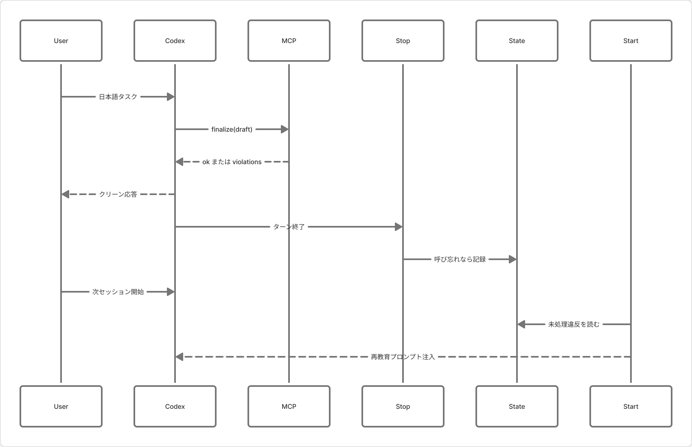
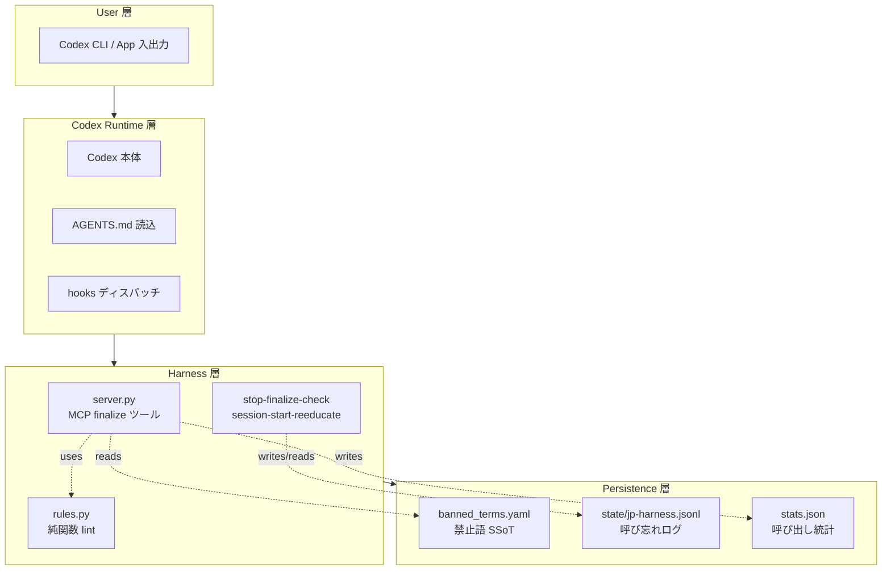
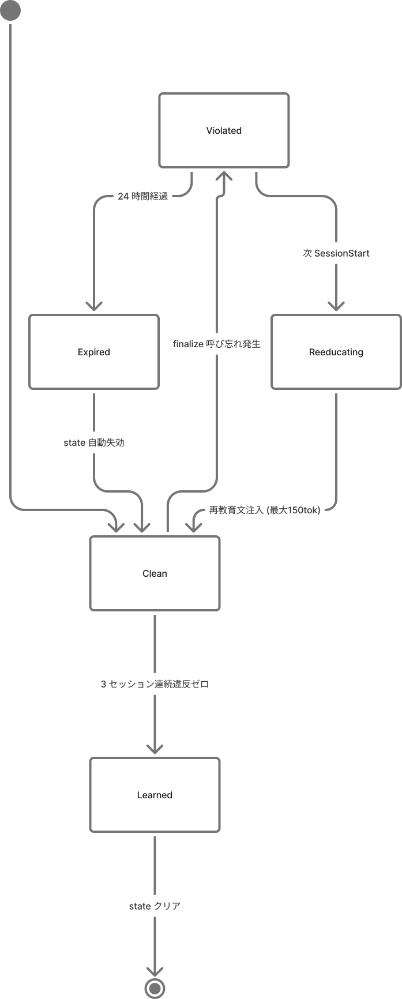

# Architecture

本ドキュメントは ja-output-harness の設計判断を記録する。MCP `finalize` ゲート（Tier 2）と Stop + SessionStart hook（Tier 1 補完）の二層構成が核で、それぞれが独立した失敗領域を埋める。

## 全体像（スイスチーズモデル）

品質担保を 4 層（規約 / MCP ゲート / hook 後方検知 / 運用監視）で重ねる「スイスチーズ」配置。各層の穴（漏れ）がずれているため、1 層抜けても他の層で捕捉される。

| 層 | 強制力 | 失敗ケース | 次層でカバー |
|---|---|---|---|
| 1. `AGENTS.md` 規約 | 低（確率論） | 指示を無視 | MCP ゲート |
| 2. MCP `finalize` ゲート | 中〜高 | 呼び忘れ | Stop hook |
| 3. Stop + SessionStart hook | 中 | hook が無効（0.120 未満 / repo-local 登録） | 運用監視 |
| 4. 運用監視（stats.json） | 低（事後） | 月次レビュー漏れ | （運用者の責任） |

## データフロー

Codex が日本語応答を返すまでの MCP 往復と、Stop → SessionStart の後方検知ループを 1 つの図にまとめたもの。

**同一ターン内の自動修正（95%+）**:
1. ユーザー入力を Codex が受領
2. Codex が下書きを生成
3. Codex が `mcp__jp_lint__finalize(draft)` を呼ぶ
4. `jp-lint` サーバーが `rules.py` で lint し、違反の種類で次のいずれかに分岐:
   - **Fast path** (v0.2.17+): 違反がすべて `banned_term` で `suggest` から置換語を抽出できる場合、server が draft を直接書き換えて `{"ok": true, "fixed": true, "rewritten": ...}` を返す。Codex は再 rewrite せず `rewritten` をそのままユーザーに返す（retry ゼロ）
   - **Slow path**: 構造的違反（`bare_identifier` / `too_many_identifiers` / `sentence_too_long` 等）を含む場合は従来通り `{"ok": false, "violations": ...}` を返す
5. slow path の場合、Codex が violations を読んで書き直して再度 `finalize`（最大 3 retry）
6. `ok: true` を得たドラフトのみユーザーに返す

Fast path は server-side の決定的な置換のみを担い、曖昧さを含む rewrite は LLM に委ねる。トークン消費を削減する主因は **retry のゼロ化**（1 ターン = 1 call で確定）。

**後方検知ループ（残り数%）**:
A. ターン終了時、Stop hook が `last_assistant_message` + transcript を走査
B. 日本語応答かつ transcript に `finalize` がなければ `~/.codex/state/jp-harness.jsonl` に `missing-finalize` を記録
C. 次回セッション起動（`source == "startup" or "clear"`）で SessionStart hook が未消化エントリを読む
D. 最大 400 文字の再教育プロンプトを stdout 経由で Codex 側に注入 → `consumed: true` で state を更新

## レイヤー責務

コンポーネントの責務を 4 層（ユーザー層 / Codex ランタイム / ハーネス / 永続化）に切り分けると、テスト容易性とアンインストール容易性が同時に得られる。

| レイヤー | コンポーネント | 責務 | 依存先 |
|---|---|---|---|
| User | Codex CLI / App 入出力 | 自然言語での対話 | - |
| Runtime | Codex 本体 / AGENTS.md / hooks | ルール読み込み、tool 呼び出し、hook 起動 | User 層 |
| Harness | `server.py` / `rules.py` / hook scripts | lint + 記録 + 再教育 | Runtime 層 |
| Persistence | `banned_terms.yaml` / `state/*.jsonl` / `stats.json` | 定義と履歴の保存 | - |

依存が一方向（上から下のみ）のため:
- `rules.py` は MCP プロトコルを知らない純関数としてテストできる
- `banned_terms.yaml` を書き換えるだけでルール変更が完結する
- hook を無効化しても MCP ゲートは独立して機能する（逆も然り）

## Context Expiry（エントリの寿命管理）

Stop hook が記録する state エントリは **24 時間の expiry** と `consumed` フラグで管理する。これにより古いエントリが永遠に再教育プロンプトとして再注入されることを防ぐ。

| 状態遷移 | トリガー | 挙動 |
|---|---|---|
| `active` → `active` | 他セッション開始（`source=resume`） | スキップ。文脈を壊さない |
| `active` → `consumed` | 次回 startup / clear で SessionStart hook 発火 | 再教育プロンプトを出力し `consumed: true` を付ける |
| `active` → `expired` | `ts + 24h < now` | SessionStart hook が無視（write もしない） |
| `consumed` → `kept` | SessionStart hook の再書き込み | state ファイルに残るが再注入されない |

**なぜ 24 時間**: 1 日に複数回 Codex セッションを開く典型的な運用で、**翌朝の最初のセッション**までに必ず再教育が届く設計。24 時間を超えたエントリは「直近の違反」ではないため再注入の価値が薄い。

**なぜ末尾 20 行のみ評価**: jsonl が長期運用で肥大化しても SessionStart hook の起動コストが一定になる。20 行あれば連続した数セッション分の違反をカバーできる。

## Tier 比較（なぜ Tier 2 + Tier 1 を選んだか）

| Tier | 手段 | 実装コスト | UX | 強制力 | Codex 機能維持 |
|---|---|---|---|---|---|
| 1 | Stop hook + 次ターン注入 | 半日 | △（違反版も見える） | 中 | 完全 |
| **2** | **MCP finalize ゲート** | **1〜2 日** | **○（クリーン版のみ）** | **中〜高** | **完全** |
| 3 | 外部ラッパースクリプト | 1〜2 週 | ◎（完全透過） | 高 | 部分喪失 |
| 4 | TUI プロキシ | 数週 | ◎ | 最高 | 完全 |

**本実装は Tier 2 + Tier 1 のハイブリッド**:
- Tier 2（MCP `finalize`）で 95%+ の違反を同一ターン内に自動修正
- Tier 1（Stop + SessionStart hook）で呼び忘れを翌セッションで再教育
- 実装 2〜3 日、Codex 機能は完全維持、UX 劣化は再教育プロンプト 400 文字のみ

ROI 最適点は Tier 2 単体ではなく Tier 2 + Tier 1。Tier 3 / 4 はコストが 10 倍で得られる違反削減は数%、採用に値しない。

## 主要コンポーネント

### `src/ja_output_harness/server.py`
Codex から呼ばれる MCP サーバー本体。FastMCP で `finalize(draft)` ツールを公開する窓口。`rules.py` の純関数にドラフトを渡して violations を返す。

### `src/ja_output_harness/rules.py`
lint ロジック。文字列を受け取り違反リストを返す純関数。副作用を持たせない（stdout 書き込み・ファイル I/O なし）。ユニットテストは 28 件 + fixtures で実応答を検証。

### `config/banned_terms.yaml`
禁止語・閾値の**単一情報源（Single Source of Truth）**。ここを書き換えればルール変更が完結する。ユーザー側の `~/.codex/jp_lint.yaml` で override / disable / add が可能。

### `hooks/stop-finalize-check.{ps1,sh}`
Stop hook スクリプト。Codex 0.120.x の stdin 仕様を受け、transcript を走査して `missing-finalize` を state に記録する。詳細は `docs/HOOKS.md`。

### `hooks/session-start-reeducate.{ps1,sh}`
SessionStart hook スクリプト。state を読んで再教育プロンプトを stdout に出力する。`source=resume` では文脈を壊さないよう発火しない。詳細は `docs/HOOKS.md`。

### `config/hooks.example.json`
`~/.codex/hooks.json` のテンプレート。install script が `{{STOP_COMMAND}}` / `{{SESSION_START_COMMAND}}` をリポジトリ内スクリプトの絶対パスで置換して書き出す。

### `hooks/bench.{ps1,sh}`
hook の性能計測。Stop < 50ms / SessionStart < 100ms（mean）を目標に 10 回実行して表示する。

## 設計原則

1. **単一情報源**: 禁止語定義は `banned_terms.yaml` 1 箇所のみ。`SKILL.md` からも参照する
2. **疎結合**: `rules.py` は MCP プロトコルを知らない純関数
3. **Graceful degradation**: MCP サーバー停止時は自己チェックで応答継続、hook 例外時は exit 0 でターン継続
4. **観測可能性**: `stats.json` に呼び出し統計を自動記録、state jsonl に呼び忘れを記録、月次レビュー可能
5. **アンインストール容易性**: `docs/DEPRECATION.md` で 1 コマンド相当のアンインストール手順を提供
6. **opt-in 実験機能**: hooks は `--enable-hooks` 指定時のみ。従来の MCP のみ運用は無影響

## トレードオフ

- **トークン消費の増分（実測値, n=91, 2026-04-21 時点）**: `ja-output-stats overhead --window 30` による実測で、**avg output-factor = 3.11× baseline（= +211% output tokens over no-finalize baseline）**。75% のターンが 1-2 call で完結し、重度 retry（5+ call）は 8%。モデルは「draft が tool 引数と最終メッセージの 2 箇所で出力される → output ≈ (retries+2) × draft per turn」。実測値は運用とともに変動するため、`uv run ja-output-stats overhead` で随時再計測できる（archive + active を連結読みするので履歴は失われない）
- **形態素解析未採用**: 依存増・起動時間増を避けるためヒューリスティックで妥協。fugashi は将来拡張
- **repo-local hook 非対応**（[Issue #17532](https://github.com/openai/codex/issues/17532)）: Codex 側のバグのためグローバル登録に限定
- **再教育プロンプト 400 文字制限**: Codex の SessionStart stdout を消化するため短く固定。違反種別は上位 3 件のみ要約

## 公式対応との関係

本ハーネスは暫定対策。以下の公式機能が揃った時点で不要になる:
- Codex 本体（CLI / App 共通）での日本語自然化
- Pre-response hook 機構（出力前書き換え）
- `PreSkillUse` / `PostSkillUse` hook（[Issue #17132](https://github.com/openai/codex/issues/17132)）

詳細は [`DEPRECATION.md`](DEPRECATION.md) 参照。

## 関連ドキュメント

- [`HOOKS.md`](HOOKS.md): Stop / SessionStart hook の詳細仕様と運用
- [`INSTALL.md`](INSTALL.md): インストール手順（パターン A / B）
- [`OPERATIONS.md`](OPERATIONS.md): 月次運用監視と指標
- [`DEPRECATION.md`](DEPRECATION.md): 公式対応時のアンインストール手順
