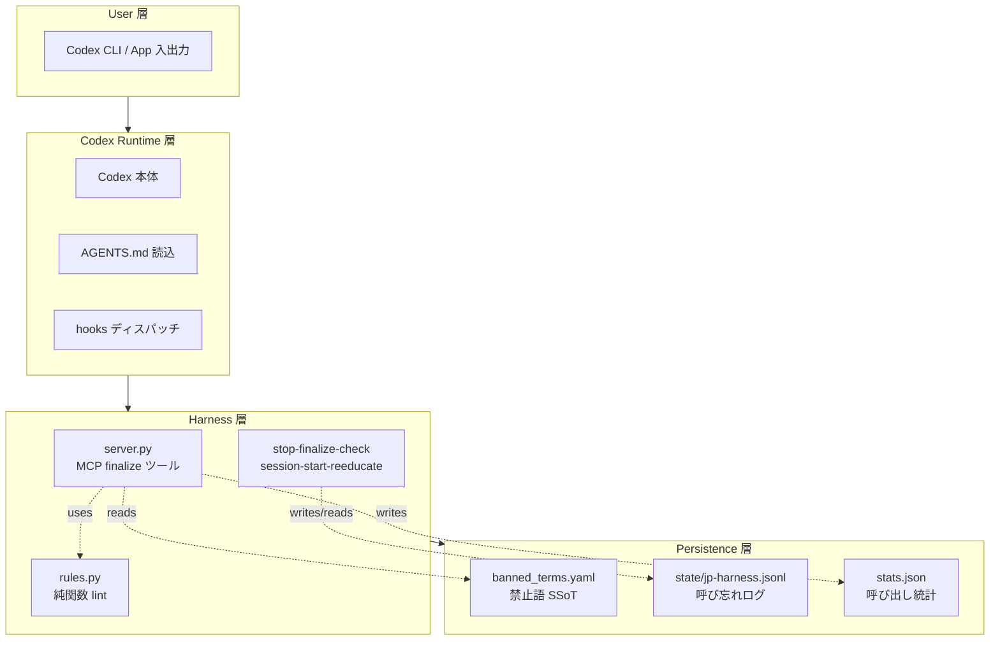

# Architecture

本ドキュメントは `ja-output-harness` の設計判断を記録する。`v0.4.0` 以降は 3 モード構成（`lite` / `strict-lite` / `strict`）で、各モードが `Stop hook` による検品と `MCP` ゲートの組み合わせを変えることで、違反検出の強さと出力トークンの増分を調整する。

## モード別アーキテクチャ（`v0.4.1+`）

| モード | 既定？ | `Stop hook` | `MCP` ゲート | 出力係数 | 増分 | 整合率 |
|---|---|---|---|---|---|---|
| **`strict-lite`** | ✅（`v0.4.1` 以降） | ローカル検品 + `jp-harness-lite.jsonl` 記録 + `ERROR` で `{"decision":"block"}` を返し言い直しを発火 | 無し | `1.00×` 〜 `1.60×`（違反率依存） | `+0.00×` 〜 `+0.60×` | 95%+ |
| `lite` | | 上と同じ仕組みから `decision:block` を外した記録のみ版 | 無し | `~1.00×` | `+0.00×` | 60-75%（仮説） |
| `strict` | | 呼び忘れ検知（`v0.3.x` 相当） | `finalize` ゲートがターンごとに下書きを検品 | `~2.00×` 〜 `3.00×` | `+1.00×` 〜 `+2.00×` | 95%+ |

`strict-lite` は現行の既定モード。`Stop hook` が Codex 公式の `{"decision":"block","reason":"..."}` を返して、同じターン内での言い直し（`continuation`）を起こす。`stop_hook_active` フラグで 2 回目以降の `block` を抑止し、1 ターンで直らない違反による無限ループを防ぐ（`v0.4.0` の外部レビュー対応）。出力トークンは違反ありのターンのみ追加が乗る構造で、違反ゼロのターンは増分ゼロ。実測レンジはドッグフードの `jp-harness-lite.jsonl` の初手 ok 率（`n=21` 時点 23.8% → `n=354` 時点 38.1% と改善中）に連動する。

`lite` は `Stop hook` が `jp-harness-lite.jsonl` に違反を記録するだけで、`block` を返さない。翌セッションで `SessionStart hook` が再教育する事後型の構成。出力トークンの増分はゼロ（`config/hooks.example.json` の外側タイムアウト 15 秒、`rules_cli` の内側タイムアウト 10 秒で守る）。

`strict` は `v0.3.x` の `MCP finalize` ゲートを使う構成。`fast path` 発火 57% と再試行 0.48 回/ターンで出力トークンが `+1.00×` 〜 `+2.00×` に収まる。従来のスイスチーズ型の多層防御はこのモードでのみ働く。統制の厳密さを優先し、出力トークンの増分を許容できる運用向けの `opt-in`。

## 全体像（多層防御）

既定の `strict-lite` は `Stop hook` を強制層に据えた 3 層構成。`strict` を選んだ場合のみ `MCP` ゲートが上位層に入り、従来のスイスチーズ型 4 層配置になる。

**`strict-lite`（既定）の層構成**:

| 層 | 強制力 | 失敗ケース | 次層でカバー |
|---|---|---|---|
| 1. `AGENTS.md` 規約 | 低（確率論） | 指示を無視 | `Stop hook` |
| 2. `Stop hook` + `{"decision":"block"}` | 高（Codex 実行系が強制） | `hook` が無効（`0.120` 未満 / リポ内登録） | `SessionStart hook` |
| 3. `SessionStart hook`（再教育） | 中 | 未消化のままセッションが続く | 運用監視 |
| 4. 運用監視（`jp-harness-metrics.jsonl` / `jp-harness-lite.jsonl`） | 低（事後） | 月次レビュー漏れ | （運用者の責任） |

**`strict`（`opt-in`）の層構成**:

| 層 | 強制力 | 失敗ケース | 次層でカバー |
|---|---|---|---|
| 1. `AGENTS.md` 規約 | 低（確率論） | 指示を無視 | `MCP` ゲート |
| 2. `MCP` `finalize` ゲート | 中〜高 | 呼び忘れ | `Stop hook`（`missing-finalize` 検知） |
| 3. `Stop` + `SessionStart hook` | 中 | `hook` が無効 | 運用監視 |
| 4. 運用監視 | 低（事後） | 月次レビュー漏れ | （運用者の責任） |

## データフロー

既定（`strict-lite`）は `Stop hook` → `continuation` → `SessionStart` の 1 本道。`strict` は `MCP` `finalize` 往復が前段に入る二段構成。

**`strict-lite` の同一ターン内での言い直し**:
1. 入力を Codex が受領
2. Codex が下書きを生成して返信（`last_assistant_message` として確定）
3. ターン終了で `Stop hook` が発火し、`rules_cli` が `last_assistant_message` を検品
4. `ERROR` 違反があれば `Stop hook` が `{"decision": "block", "reason": "..."}` を標準出力に書く
5. Codex は同じターン内で `continuation` を発火し、違反を読み直して書き直す
6. 再発火時の `Stop hook` は `stop_hook_active == true` を検知して `block` を抑止する（無限ループ回避）
7. 結果は `~/.codex/state/jp-harness-lite.jsonl` に `metrics.record_lite` 経由で追記される

`ERROR` ゼロのターンは手順 4 以降を走らせない。違反ゼロなら出力トークンは 1 バイトも増えない。

**`strict` の `MCP` 往復（`opt-in`）**:
1. ユーザー入力を Codex が受領
2. Codex が下書きを生成
3. Codex が `mcp__jp_lint__finalize(draft)` を呼ぶ
4. `jp-lint` サーバーが `rules.py` で lint し、違反の種類で次のいずれかに分岐:
   - **Fast path** (v0.2.17 以降): ERROR がすべて以下のいずれかに該当する場合、server が draft を直接書き換えて `{"ok": true, "fixed": true, "rewritten": ...}` を返す。Codex は再 rewrite せず `rewritten` をそのままユーザーに返す（retry ゼロ）:
     - `banned_term`（`suggest` から置換語を抽出可能）
     - `bare_identifier`（バッククォートで囲む）
     - `pr_issue_number`（`PR #123` / `issue #42` をバッククォートで囲む）
     - `too_many_identifiers` / `sentence_too_long`（識別子 wrap の副次効果で解消するケース）
   - **Slow path**: 構造的違反を含む場合は `{"ok": false, "violations": ...}` を返す
5. slow path の場合、Codex が violations を読んで書き直して再度 `finalize`（最大 3 retry）
6. `ok: true` を得たドラフトのみユーザーに返す

`strict` の `fast path` はサーバー側の決定的な置換のみを担い、曖昧さを含む書き直しは LLM に委ねる。トークン消費を削減する主因は **再試行のゼロ化**（1 ターン = 1 呼び出しで確定）。

**後方検知ループ（全モード共通）**:
A. ターン終了時、`Stop hook` が `last_assistant_message` と会話ログを走査
B. **`strict-lite` / `lite`**: 違反があれば違反種別ごと（`banned_term` / `bare_identifier` / `sentence_too_long` 等）と集計を `~/.codex/state/jp-harness-lite.jsonl` に記録
C. **`strict`**: 日本語応答かつ会話ログに `finalize` の呼び出し痕跡がなければ `~/.codex/state/jp-harness.jsonl` に `missing-finalize` を記録
D. 次回セッション起動（`source == "startup"` または `"clear"`）で `SessionStart hook` が `jp-harness-cursor.json` を使って未消化エントリを安全に読む
E. 最大 400 文字の再教育プロンプトを標準出力から Codex 側に注入し、カーソルを進めて再注入を抑止

## レイヤー責務

コンポーネントの責務を 4 層（ユーザー層 / Codex ランタイム / ハーネス / 永続化）に切り分けると、テスト容易性とアンインストール容易性が同時に得られる。

| レイヤー | コンポーネント | 責務 | 依存先 |
|---|---|---|---|
| User | Codex CLI / App 入出力 | 自然言語での対話 | - |
| Runtime | Codex 本体 / AGENTS.md / hooks | ルール読み込み、tool 呼び出し、hook 起動 | User 層 |
| Harness | `server.py` / `rules.py` / hook scripts | lint + 記録 + 再教育 | Runtime 層 |
| Persistence | `banned_terms.yaml` / `state/*.jsonl` / `stats.json` | 定義と履歴の保存 | - |

依存が一方向（上から下のみ）のため:
- `rules.py` は MCP プロトコルを知らない純関数としてテストできる
- `banned_terms.yaml` を書き換えるだけでルール変更が完結する
- hook を無効化しても MCP ゲートは独立して機能する（逆も然り）

## Context Expiry（エントリの寿命管理）

Stop hook が記録する state エントリは **24 時間の expiry** と `consumed` フラグで管理する。これにより古いエントリが永遠に再教育プロンプトとして再注入されることを防ぐ。

| 状態遷移 | トリガー | 挙動 |
|---|---|---|
| `active` → `active` | 他セッション開始（`source=resume`） | スキップ。文脈を壊さない |
| `active` → `consumed` | 次回 startup / clear で SessionStart hook 発火 | 再教育プロンプトを出力し `consumed: true` を付ける |
| `active` → `expired` | `ts + 24h < now` | SessionStart hook が無視（write もしない） |
| `consumed` → `kept` | SessionStart hook の再書き込み | state ファイルに残るが再注入されない |

**なぜ 24 時間**: 1 日に複数回 Codex セッションを開く典型的な運用で、**翌朝の最初のセッション**までに必ず再教育が届く設計。24 時間を超えたエントリは「直近の違反」ではないため再注入の価値が薄い。

**なぜ末尾 20 行のみ評価**: jsonl が長期運用で肥大化しても SessionStart hook の起動コストが一定になる。20 行あれば連続した数セッション分の違反をカバーできる。

## 層の比較（なぜ既定を 1 層のみにしたか）

| 層 | 手段 | 実装コスト | 体験 | 強制力 | Codex 機能の保全 | 出力トークンの増分 |
|---|---|---|---|---|---|---|
| **1** | **`Stop hook` + `{"decision":"block"}` で言い直しを発火** | **半日** | **△（違反版も一瞬見える）** | **高（Codex の実行系が強制）** | **完全** | **違反率に比例** |
| 2 | `MCP finalize` ゲート | 1〜2 日 | ○（整えた版のみ表示） | 中〜高 | 完全 | `+1.00×` 〜 `+2.00×`（毎ターン） |
| 3 | 外部ラッパースクリプト | 1〜2 週 | ◎（完全に透過） | 高 | 一部喪失 | 方式依存 |
| 4 | 端末プロキシ | 数週 | ◎ | 最高 | 完全 | 方式依存 |

**既定（`strict-lite`）は 1 層のみ**:
- `Stop hook` + `continuation` は Codex `0.120` で公式に公開された `{"decision":"block"}` を使うので、`MCP` を経由せずに Codex 本体側で `block` を強制できる
- 違反ゼロのターンは増分ゼロ。違反時のみ `continuation` 1 ターン分が乗る
- 「違反版が一瞬見える」弱点は残るが、書き直しが秒単位で入るため最終的にユーザーに残るのは整えた版のみ
- 実装は 2〜3 日、Codex 機能は完全に保全され、体験の劣化は再教育プロンプト 400 文字のみ

**統制を厳密に効かせたいときは `strict`（1 層 + 2 層）**:
- 違反が「一瞬でも見える」ことを許容できないケース（コンプライアンス文書の自動起草など）では `MCP` ゲートを `opt-in` する
- 毎ターン `+1.00×` 〜 `+2.00×` の出力トークンを支払うが、ユーザーに届くのは常に整えた版のみ

一般的なドッグフードでの最適点は 1 層のみ。3 層・4 層は投資が 10 倍で得られる違反削減は数 % にとどまり、採用に値しない。

## 主要コンポーネント

### `src/ja_output_harness/rules_cli.py`
`Stop hook` から呼ばれる CLI 入口。標準入力で受け取った下書きを `rules.py` で検品し、`ERROR` があれば `{"decision":"block","reason":"..."}` を標準出力に書く。`strict-lite` と `lite` の主経路。`--append-lite` フラグで `jp-harness-lite.jsonl` への記録も同 CLI 内で完結する（`v0.4.2`）。

### `src/ja_output_harness/server.py`
`strict` モード専用の `MCP` サーバー本体。`FastMCP` で `finalize(draft)` を公開し、`rules.py` の純関数に下書きを渡して違反リストを返す。`strict-lite` と `lite` では導入されない。

### `src/ja_output_harness/metrics.py`
`record_lite` / `record` の書き込み関数。`_rotate_lock` と `_maybe_rotate` で同時追記の競合と 20 MB 世代交代を制御する。`strict-lite` は `record_lite` 経由、`strict` は `server.py` 側の `record` 経由。

### `src/ja_output_harness/rules.py`
lint ロジック。文字列を受け取り違反リストを返す純関数。副作用を持たせない（stdout 書き込み・ファイル I/O なし）。ユニットテストは 28 件 + fixtures で実応答を検証。

### `config/banned_terms.yaml`
禁止語・閾値の**単一情報源（Single Source of Truth）**。ここを書き換えればルール変更が完結する。ユーザー側の `~/.codex/jp_lint.yaml` で override / disable / add が可能。

### `hooks/stop-finalize-check.{ps1,sh}`
`Stop hook` スクリプト。Codex `0.120.x` の標準入力仕様を受け、モード別に挙動を分岐する:
- **`strict-lite` / `lite`**: `rules_cli --append-lite` を呼び、違反があれば `{"decision":"block"}` を返す（`lite` は `decision:block` を返さない）
- **`strict`**: 会話ログを走査して `missing-finalize` を `jp-harness.jsonl` に記録

詳細は `docs/HOOKS.md`。

### `hooks/session-start-reeducate.{ps1,sh}`
SessionStart hook スクリプト。state を読んで再教育プロンプトを stdout に出力する。`source=resume` では文脈を壊さないよう発火しない。詳細は `docs/HOOKS.md`。

### `config/hooks.example.json`
`~/.codex/hooks.json` のテンプレート。install script が `{{STOP_COMMAND}}` / `{{SESSION_START_COMMAND}}` をリポジトリ内スクリプトの絶対パスで置換して書き出す。

### `hooks/bench.{ps1,sh}`
hook の性能計測。Stop < 50ms / SessionStart < 100ms（mean）を目標に 10 回実行して表示する。

## 設計原則

1. **単一情報源**: 禁止語定義は `banned_terms.yaml` 1 箇所のみ。`SKILL.md` からも参照する
2. **疎結合**: `rules.py` は MCP プロトコルを知らない純関数
3. **Graceful degradation**: MCP サーバー停止時は自己チェックで応答継続、hook 例外時は exit 0 でターン継続
4. **観測可能性**: `stats.json` に呼び出し統計を自動記録、state jsonl に呼び忘れを記録、月次レビュー可能
5. **アンインストール容易性**: `docs/DEPRECATION.md` で 1 コマンド相当のアンインストール手順を提供
6. **モードの明示**: 導入スクリプトは `--mode` 指定または Codex CLI の有無で `strict-lite` / `lite` / `strict` を選ぶ。既定は `strict-lite`（CLI 検出時）または `strict`（App 単独環境）

## トレードオフ

- **トークン消費の増分（モード別）**:
  - **`strict-lite`（既定）**: 出力トークンは違反率に比例する。ドッグフードの `jp-harness-lite.jsonl` の初手 ok 率は `n=21` 時点 23.8% → `n=354` 時点 38.1% と改善中で、増分の幅は `1.00×` 〜 `1.60×`（違反ゼロのターンは `1.00×`）。`ja-output-stats show` のルール別分布を見て `banned_terms.yaml` の調整方向を決める
  - **`strict`（`opt-in`）**: `ja-output-stats overhead --window 30` で **ターン平均の出力係数 `≈ 3.00×`**（基準比 `+200%`）。旧世代 `v0.2.22` 時点の `3.58×` から 16% 改善。87% のターンが 1〜2 回の呼び出しで確定し、`fast path` 発火率は全体 12.9%（`v0.3.8` 後の新スキーマに絞った `n=14` では 57% と期待域 40-60% に戻った）。下書きが呼び出し引数と最終メッセージの 2 箇所で出る構造上、`出力 ≈ (再試行数+2) × 下書き/ターン` の式が成立する
  - **`lite`**: `1.00×`（違反時も `block` を返さないため言い直しが起きない）
- **形態素解析の未採用**: 依存増加と起動時間増加を避けるためヒューリスティックで妥協。`fugashi` は将来の拡張候補
- **リポ内 `hook` の非対応**（[Issue #17532](https://github.com/openai/codex/issues/17532)）: Codex 側のバグのためグローバル登録に限る
- **再教育プロンプトの 400 文字上限**: Codex の `SessionStart` 標準出力を消化するため短く固定。違反種別は上位 3 件のみ要約
- **Codex App での `hook` 発火**: Codex `0.122` の実験機能許可リストに `codex_hooks` が無く、App 単独環境では `strict-lite` や `lite` が動かない場合がある。導入時に Codex CLI が検出できないと `strict` に自動でフォールバックする

## 公式対応との関係

本ハーネスは暫定対策。以下の公式機能が揃った時点で不要になる:
- Codex 本体（CLI / App 共通）での日本語自然化
- Pre-response hook 機構（出力前書き換え）
- `PreSkillUse` / `PostSkillUse` hook（[Issue #17132](https://github.com/openai/codex/issues/17132)）

詳細は [`DEPRECATION.md`](DEPRECATION.md) 参照。

## 関連ドキュメント

- [`HOOKS.md`](HOOKS.md): Stop / SessionStart hook の詳細仕様と運用
- [`INSTALL.md`](INSTALL.md): インストール手順（パターン A / B）
- [`OPERATIONS.md`](OPERATIONS.md): 月次運用監視と指標
- [`DEPRECATION.md`](DEPRECATION.md): 公式対応時のアンインストール手順
